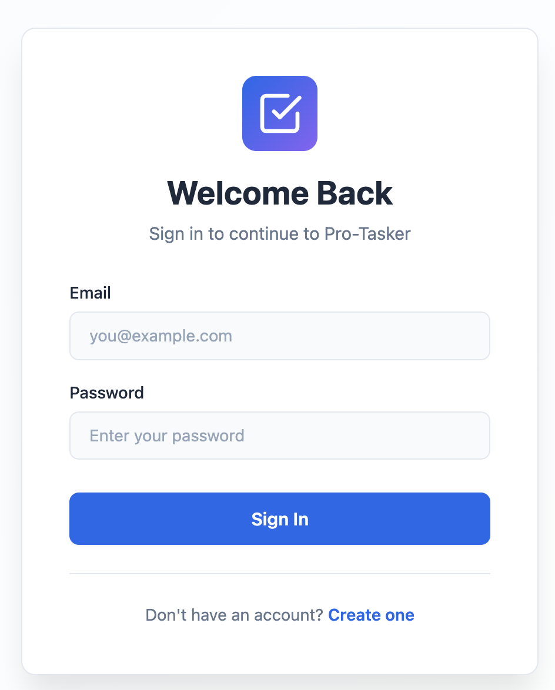
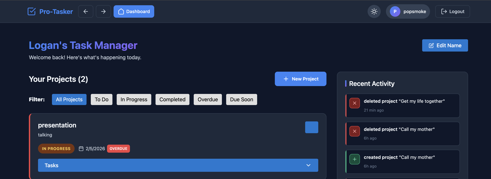
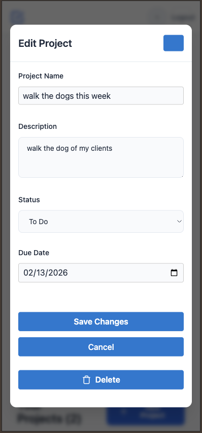

# Pro-Tasker

A full-stack project management application built with the MERN stack (MongoDB, Express, React, Node.js). Pro-Tasker helps users organize projects and tasks with real-time activity tracking, dynamic filtering, and intelligent due date warnings.


 **Live Demo:** [https://capstone-frontend-yyqw.onrender.com](https://capstone-backend-mbit.onrender.com)

---

## Features

- **User Authentication** - Secure JWT-based registration and login with bcrypt password hashing
- **Project Management** - Full CRUD operations for organizing projects
- **Task Management** - Nested task creation within projects with complete lifecycle management
- **Activity Tracking** - Real-time audit trail of all user actions
- **Smart Filtering** - Dynamic filtering by status (To Do, In Progress, Completed), overdue items, and due soon
- **Visual Indicators** - Red pulsing notification for tasks due within 3 days
- **Dark/Light Mode** - Theme toggle with localStorage persistence
- **Responsive Design** - Mobile-first approach with seamless experience across all devices
- **Dashboard Customization** - Personalized nickname display

---

## Tech Stack

### Frontend
- React 19.0.0
- React Router DOM 7.13.0
- Axios for HTTP requests
- Vite for build tooling
- Context API for state management

### Backend
- Node.js with Express.js
- MongoDB with Mongoose ODM
- JSON Web Tokens (JWT) for authentication
- Bcrypt for password hashing
- CORS for cross-origin resource sharing

### Deployment
- Frontend: Render (Static Site)
- Backend: Render (Web Service)
- Database: MongoDB Atlas

---

## Getting Started

### Prerequisites

- Node.js (v16 or higher)
- MongoDB (local installation or MongoDB Atlas account)
- npm or yarn package manager

### Installation

1. **Clone the repository**
```bash
   git clone https://github.com/ShymeetriaJ/Capstone-frontend.git
   cd Capstone
```

2. **Backend Setup**
```bash
   cd backend
   npm install
```

   Create a `.env` file in the `backend` directory:
```env
   MONGO_URI=mongodb://localhost:27017/protasker
   JWT_SECRET=your_secure_random_secret_key
   PORT=3000
```

   Start the backend server:
```bash
   npm start
```

3. **Frontend Setup**
```bash
   cd frontend
   npm install
```

   Create a `.env` file in the `frontend` directory:
```env
   VITE_API_URL=http://localhost:3000
```

   Start the development server:
```bash
   npm run dev
```

4. **Access the application**
   - Frontend: `http://localhost:3001`
   - Backend API: `http://localhost:3000`

---

## API Endpoints

### Authentication
- `POST /api/users/register` - Register new user
- `POST /api/users/login` - Login user
- `GET /api/users/profile` - Get user profile (protected)
- `PUT /api/users/nickname` - Update dashboard nickname (protected)

### Projects
- `GET /api/projects` - Get all projects with optional filters
- `POST /api/projects` - Create new project (protected)
- `GET /api/projects/:id` - Get project by ID (protected)
- `PUT /api/projects/:id` - Update project (protected)
- `DELETE /api/projects/:id` - Delete project (protected)

### Tasks
- `GET /api/projects/:projectId/tasks` - Get all tasks for a project
- `POST /api/projects/:projectId/tasks` - Create new task (protected)
- `PUT /api/projects/:projectId/tasks/:taskId` - Update task (protected)
- `DELETE /api/projects/:projectId/tasks/:taskId` - Delete task (protected)

### Activities
- `GET /api/activities/recent?limit=5` - Get recent activities (protected)

---

## Authentication

This application uses JWT (JSON Web Tokens) for authentication. After successful login, the token is stored in `localStorage` and automatically included in all subsequent API requests via Axios interceptors.

---

## Project Structure
```
protasker/
├── backend/
│   ├── controllers/
│   │   ├── authController.js
│   │   ├── projectController.js
│   │   ├── taskController.js
│   │   └── activityController.js
│   ├── models/
│   │   ├── User.js
│   │   ├── Project.js
│   │   ├── Task.js
│   │   └── Activity.js
│   ├── routes/
│   │   ├── authRoutes.js
│   │   ├── projectRoutes.js
│   │   ├── taskRoutes.js
│   │   └── activityRoutes.js
│   ├── utils/
│   │   └── authMiddleware.js
│   ├── .env
│   └── server.js
└── frontend/
    ├── src/
    │   ├── components/
    │   ├── context/
    │   ├── pages/
    │   ├── services/
    │   └── styles/
    ├── .env
    └── vite.config.js
```

---

## Key Features Explained

### Red Pulsing Indicator
Tasks due within 3 days display a pulsing red dot using CSS animations and date calculations with `Math.ceil()` to ensure proper day counting.

### Activity Tracking
Every CRUD operation automatically creates an Activity record, providing users with a complete audit trail. Activities persist even after the associated project or task is deleted.

### Smart Filtering
Users can filter projects and tasks by:
- Status (To Do, In Progress, Completed)
- Overdue items
- Items due soon (within 3 days)

---

## Troubleshooting

### Backend Issues

**Problem:** Cannot connect to MongoDB
- Verify MongoDB is running: `mongod`
- Check `MONGO_URI` in `.env` is correct
- For MongoDB Atlas, ensure IP whitelist includes your current IP

**Problem:** Port already in use
- Kill the process using port 3000: `lsof -ti:3000 | xargs kill -9`
- Or change `PORT` in `.env`

### Frontend Issues

**Problem:** Network Error when making API requests
- Verify backend is running on `http://localhost:3000`
- Check `VITE_API_URL` in `frontend/.env`
- Restart frontend dev server after changing `.env`

**Problem:** CORS Error
- Ensure `cors` package is installed in backend
- Verify `app.use(cors())` is in `server.js` before routes
- Restart backend server

---

## Deployment

### Backend (Render)
1. Create a new Web Service on Render
2. Connect your GitHub repository
3. Set environment variables:
   - `MONGO_URI`: Your MongoDB Atlas connection string
   - `JWT_SECRET`: Secure random string
   - `PORT`: 3000
4. Deploy

### Frontend (Render)
1. Create a new Static Site on Render
2. Connect your GitHub repository
3. Build command: `npm run build`
4. Publish directory: `dist`
5. Add environment variable:
   - `VITE_API_URL`: Your deployed backend URL
6. Deploy

---

## Screenshots






---

## License

This project is [MIT](LICENSE) licensed.

---

## Author

**Jai Jones**

- GitHub: [](https://github.com/ShymeetriaJ)
- LinkedIn: [](https://www.linkedin.com/in/sjai-jones/)
- Portfolio: []()

---

## 🙏 Acknowledgments

- CSS Reset adapted from [Bryan Santos]
- Pulsing animation inspired by [Stack Overflow community](https://stackoverflow.com/questions/47437562)
- Date calculation patterns from [GeeksforGeeks](https://www.geeksforgeeks.org/)
- Token refresh pattern adapted from [Veljko Ilic's Medium article](https://medium.com/@velja)
- React documentation and best practices from [React.dev](https://react.dev)

---

## 📝 Notes

Built as a capstone project to demonstrate full-stack development skills including:
- RESTful API design
- JWT authentication
- React Context API for state management
- Responsive design principles
- MongoDB data modeling with nested relationships
- Production deployment on Render

---